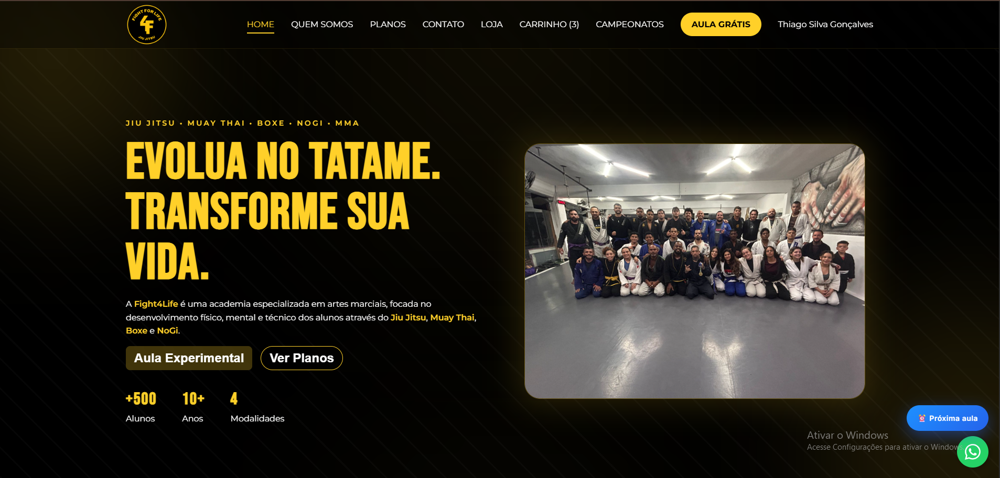

# 🥋 Fight For Life

### Plataforma web e mobile para gestão, acompanhamento e experiência dos alunos

🔗 **Demonstração:**  
Em desenvolvimento

---

## 📸 Prévia



---

# ✨ Sobre o projeto

O **Fight For Life** é uma plataforma desenvolvida para modernizar a experiência dos alunos e otimizar a gestão da academia.

Mais do que um site institucional, o projeto reúne **área do aluno, loja online, autenticação, gerenciamento de dados e futuramente um aplicativo mobile completo**, centralizando diversas funcionalidades em um único ecossistema.

O objetivo é transformar a relação entre academia e aluno através da tecnologia.

---

# 🎯 Objetivos

Desenvolver uma plataforma capaz de:

- melhorar a experiência dos alunos
- facilitar o acesso às informações da academia
- centralizar serviços em um único sistema
- oferecer uma loja integrada
- permitir expansão contínua de novas funcionalidades
- disponibilizar versão web e aplicativo mobile

---

# 💡 Funcionalidades atuais

- 🥋 Site institucional completo
- 👤 Área do aluno
- 🔐 Sistema de autenticação
- 🛒 Loja virtual integrada
- 💳 Integração com gateway de pagamento
- 📦 Consumo de APIs externas
- ☁️ Banco de dados em tempo real
- 📱 Layout totalmente responsivo

---

# 🚧 Funcionalidades em desenvolvimento

O projeto continua em evolução.

Entre as próximas funcionalidades estão:

- 📲 Aplicativo React Native
- 📅 Agendamento de aulas
- 📈 Acompanhamento de evolução
- 🏆 Histórico de treinos
- 🎯 Metas pessoais
- 📊 Dashboard do aluno
- 💬 Comunicação entre academia e alunos
- 🔔 Sistema de notificações
- 📷 Upload de documentos e imagens
- 🎖️ Sistema de graduação
- 📦 Histórico de compras
- ❤️ Área personalizada do aluno

---

# ⚙️ Arquitetura

O projeto utiliza uma arquitetura moderna baseada em componentes reutilizáveis e integração entre frontend, backend e serviços externos.

### Front-end

- React
- Vite
- React Router
- SCSS
- React Hooks

### Back-end

- Node.js
- API REST
- Integração com serviços externos
- Regras de negócio centralizadas

### Banco de Dados

- Firebase Authentication
- Cloud Firestore

### Pagamentos

- Integração com gateway de pagamento
- Consumo de APIs financeiras
- Processamento de pedidos

---

# 🧠 Destaques técnicos

### 🔐 Autenticação

- Login seguro com Firebase Authentication
- Controle de sessão
- Proteção de rotas
- Gerenciamento de usuários

### 🛒 E-commerce

- Loja integrada
- Catálogo de produtos
- Carrinho de compras
- Checkout
- Integração com pagamentos

### ⚡ Performance

- Componentização
- Lazy Loading
- Código organizado
- Navegação SPA
- Estrutura escalável

### ☁️ Integração

- Consumo de APIs
- Banco de dados em tempo real
- Comunicação entre frontend e backend

---

# 📱 Aplicativo Mobile

O projeto também contará com uma versão em **React Native**, oferecendo uma experiência completa para os alunos.

Entre os recursos planejados:

- Login
- Área do aluno
- Histórico de treinos
- Evolução
- Agendamentos
- Loja
- Notificações
- Perfil
- Pagamentos

---

# 🛠️ Stack Tecnológica

## Front-end

- React
- Vite
- JavaScript
- SCSS
- React Router

## Back-end

- Node.js

## Banco de Dados

- Firebase
- Firestore
- Firebase Authentication

## APIs

- REST API
- Gateway de Pagamentos

## Mobile

- React Native (Em desenvolvimento)

---

# 📈 Status do Projeto

🚧 Em desenvolvimento ativo

Novas funcionalidades estão sendo implementadas continuamente, com foco em escalabilidade, desempenho e experiência do usuário.

---

# 🚀 Como executar

```bash
git clone https://github.com/seu-usuario/fight-for-life.git

cd fight-for-life

npm install

npm run dev
```

---

# 👨‍💻 Desenvolvedor

Desenvolvido por **Thiago SG**

Especializado em desenvolvimento Full Stack utilizando React, Node.js, Firebase e React Native, criando aplicações modernas, escaláveis e focadas na experiência do usuário.